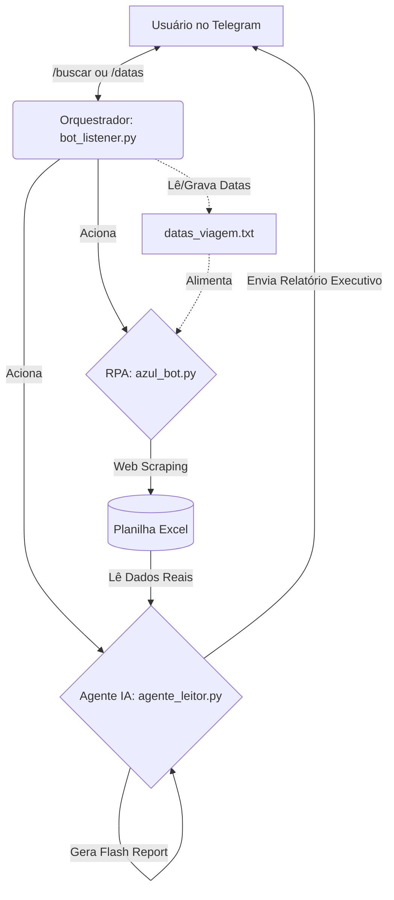

# ✈️ Agente Autônomo de Emissões (RPA + LLM)

Este projeto evoluiu de um simples bot de extração de dados (RPA) para uma **Arquitetura Event-Driven de Agente Autônomo**. Ele combina automação web clássica com a capacidade analítica da Inteligência Artificial (Google Gemini) e comandos via ChatOps (Telegram), permitindo total controle dinâmico pelo celular.

## 🧠 Arquitetura do Sistema

O sistema separa claramente o "Músculo" (extração de dados brutos), o "Cérebro" (tomada de decisão) e a "Interface" (gestão do usuário via Telegram).



## 🌟 Novas Funcionalidades (v2.0)
* **Gestão Dinâmica de Estado (CRUD):** Através do comando `/datas` no Telegram, é possível listar, incluir, excluir ou substituir as datas de busca em tempo real, sem precisar tocar no código.
* **Segurança Aprimorada (.env):** Todos os tokens e chaves de API foram isolados usando a biblioteca `python-dotenv`.
* **IA Otimizada (Flash Report):** O prompt do LLM foi refinado para gerar um relatório executivo de leitura rápida (5 segundos), direto ao ponto (Melhor Preço, Custo Total, Balanço e Veredito).

## 🛠️ Tecnologias Utilizadas
* **RPA (Automação Web):** Python + Playwright
* **Manipulação de Dados:** Pandas + Openpyxl
* **Inteligência Artificial (LLM):** Google GenAI (Gemini 2.5 Flash)
* **Orquestração e Notificação:** pyTelegramBotAPI (Long Polling)
* **Segurança:** python-dotenv

## ⚙️ Como Funciona
1. **O Listener (Recepção 24/7):** O `bot_listener.py` fica hospedado ouvindo comandos no Telegram.
2. **Gestão de Parâmetros:** O usuário envia datas via chat, e o bot atualiza o arquivo `datas_viagem.txt` dinamicamente.
3. **Extração sob demanda:** Ao receber `/buscar`, o robô Playwright navega na Azul, burla proteções antibot básicas, raspa os preços das datas alvo e salva na base de dados.
4. **Análise de Contexto:** O Agente de IA (`agente_leitor_excel.py`) cruza o custo total para 2 passageiros com o saldo restrito de pontos do usuário, considerando ativos extras (Clube Azul, Cartão C6 Carbon).
5. **Relatório NLG:** A IA redige um alerta executivo recomendando a "Compra" ou "Espera" e detalhando o déficit exato no Telegram.

## 🚀 Como Executar Localmente
1. Clone o repositório.
2. Instale as dependências: `pip install playwright pandas openpyxl google-genai pyTelegramBotAPI python-dotenv`
3. Instale os navegadores do Playwright: `playwright install chromium`
4. Crie um arquivo chamado `.env` na raiz do projeto e preencha suas chaves:
   ```env
   TOKEN_TELEGRAM=seu_token_aqui
   CHAT_ID_ARLINDO=seu_chat_id_aqui
   CHAVE_API_GOOGLE=sua_chave_gemini_aqui
   ```
5. Inicie o orquestrador: `python bot_listener.py`
6. Envie o comando `/datas` ou `/buscar` para o seu bot no Telegram.

---
👤 **Autor:** Arlindo Júnior Honorato  
Technical Product Manager | Automação | IA aplicada a Produtos Financeiros e Eficiência de Backoffice
