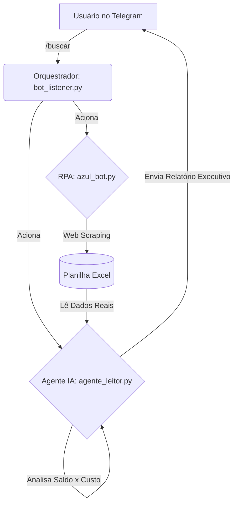

# ✈️ Agente Autônomo de Emissões (RPA + LLM)

Este projeto evoluiu de um simples bot de extração de dados (RPA) para uma **Arquitetura Event-Driven de Agente Autônomo**, combinando automação web clássica com a capacidade analítica da Inteligência Artificial (Google Gemini) e comandos via ChatOps (Telegram).

## 🧠 Arquitetura do Sistema

O sistema separa claramente o "Músculo" (extração de dados brutos) do "Cérebro" (tomada de decisão baseada em contexto financeiro).

🛠️ Tecnologias Utilizadas

- RPA (Automação Web): Python + Playwright

- Manipulação de Dados: Pandas + Openpyxl

- Inteligência Artificial (LLM): Google GenAI (Gemini 2.5 Flash)

- Orquestração e Notificação: pyTelegramBotAPI (Long Polling)

⚙️ Como Funciona

- O Listener (Recepção 24/7): O bot_listener.py fica hospedado ouvindo comandos no Telegram.

- Extração sob demanda: Ao receber o comando /buscar, ele invoca silenciosamente o robô Playwright que navega na Azul, burla proteções antibot básicas, raspa os preços do dia e salva na base de dados (Excel).

- Análise de Contexto: O Agente de IA (agente_leitor_excel.py) entra em ação. Ele não apenas lê o menor preço, mas processa a regra de negócio: cruza o custo total para 2 passageiros com o saldo restrito de pontos do usuário.

- Relatório NLG (Natural Language Generation): A IA redige um alerta executivo recomendando a "Compra" ou "Espera" e detalhando o déficit exato, enviando diretamente para o celular do usuário via API do Telegram.

🚀 Como Executar

- Clone o repositório.

- Instale as dependências: pip install playwright pandas openpyxl google-genai pyTelegramBotAPI

- Instale os navegadores do Playwright: playwright install chromium

- Preencha suas chaves (Google Gemini e Telegram) nos arquivos correspondentes.

- Inicie o orquestrador: python bot_listener.py

- Envie o comando /buscar para o seu bot no Telegram.

---
​👤 Autor​Arlindo Júnior Honorato Technical Product Manager | Automação | IA aplicada a Produtos Financeiros e Eficiência de Backoffice
